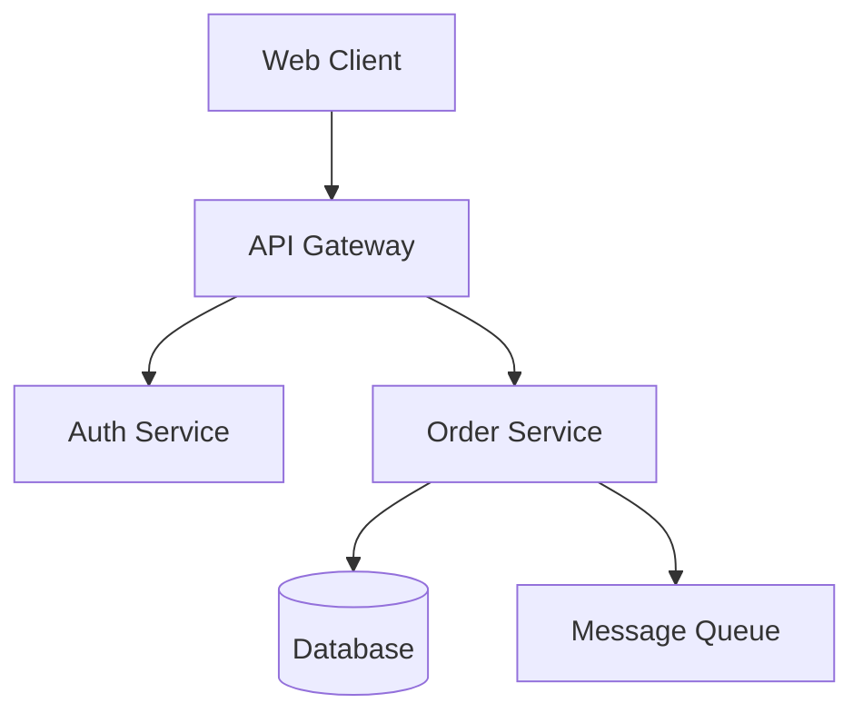

# GitHub README Best Practices

A reference guide for writing effective README files
targeting GitHub publication.

## Purpose of a README

The README is the front door of a repository. It
must answer three questions in seconds:

1. **What** does this project do?
2. **Why** should I care?
3. **How** do I get started?

Everything else is supporting detail.

## Structure

Order sections by what readers need first:

1. **Title and description** — the hook
2. **Badges** — at-a-glance project health
3. **Features** — why this project exists
4. **Prerequisites** — what you need before starting
5. **Getting started** — install and first run
6. **Usage** — common commands and examples
7. **Configuration** — environment variables, config
   files
8. **Architecture** — high-level design (optional)
9. **Contributing** — how to help
10. **License** — legal terms

Not every project needs every section. Remove what
does not apply.

## Writing style

- **Concise** — short paragraphs, bullet lists,
  tables. Avoid walls of text.
- **Scannable** — readers skim. Use headings, bold
  text, and code formatting to create visual
  anchors.
- **Action-oriented** — start instructions with
  verbs: "Install", "Run", "Configure".
- **Present tense** — "The server starts on port
  8080", not "The server will start".
- **Second person** — address the reader as "you".
- **No jargon without context** — define acronyms
  on first use or link to explanations.

## Title and description

- Use the project name as an H1 heading.
- Follow with one to three sentences explaining
  what the project does, who it is for, and what
  problem it solves.
- Avoid repeating the project name in the
  description.
- Do not start with "This is a..." — lead with
  what it does.

Good:

```markdown
# dataforge

Transforms messy CSV exports into clean, typed
datasets ready for analysis. Built for data
engineers who are tired of writing one-off
cleaning scripts.
```

## Badges

Place badges on a single line directly below the
description. Only include badges that reflect
real, working infrastructure:

| Badge type   | When to include              |
| ------------ | ---------------------------- |
| CI status    | Working GitHub Actions or CI |
| License      | LICENSE file exists          |
| Version      | Published to a registry      |
| Coverage     | Coverage reporting is set up |
| Docker image | Image is published           |

Do not add aspirational badges for things that do
not exist yet.

Badge format (shields.io):

```markdown
[][ci]
[](LICENSE)

[ci]: https://github.com/OWNER/REPO/actions
```

## Features section

- Use a bullet list with 3 to 7 items.
- Lead each item with a bold keyword or phrase.
- Focus on outcomes, not implementation details.

Good:

```markdown
## Features

- **Fast ingestion** — processes 1M rows/sec on
  commodity hardware
- **Type inference** — detects column types
  automatically
- **Pluggable outputs** — write to Parquet, JSON,
  or any custom sink
```

## Prerequisites

Only list what is not obvious:

- Runtime versions (e.g. Node.js >= 20, Python 3.12+)
- External services (e.g. PostgreSQL, Redis)
- API keys or accounts
- OS-specific requirements

Omit if the Getting Started section covers
everything.

## Getting started

Provide the shortest path from zero to running:

1. Clone or install
2. Configure (if needed)
3. Run

Use fenced code blocks with language tags:

````markdown
```bash
git clone https://github.com/owner/repo.git
cd repo
npm install
npm start
```
````

For projects with multiple installation methods
(brew, pip, cargo, Docker), show the most common
one first, then list alternatives.

## Usage and examples

- Show real commands and realistic output.
- Start with the simplest use case, then show
  advanced options.
- Use fenced code blocks with language tags for
  all code.
- For libraries, show a minimal import-and-use
  snippet.
- For CLI tools, show the most common invocation.
- For web apps, describe how to access the UI.

## Configuration

Use a table for environment variables or config
options:

```markdown
| Variable      | Description          | Default   |
| ------------- | -------------------- | --------- |
| `PORT`        | Server listen port   | `8080`    |
| `DATABASE_URL`| PostgreSQL connection | (required)|
| `LOG_LEVEL`   | Logging verbosity    | `info`    |
```

For config files, show a minimal annotated example.

## Architecture section

Include only for non-trivial projects where the
structure is not obvious from the directory layout.

### Architecture diagram

Use a Mermaid diagram to illustrate high-level
components and their interactions. Mermaid renders
natively on GitHub — prefer it over ASCII art.

Guidelines:

- Keep diagrams simple: 5 to 10 nodes maximum.
- Show components, not implementation details.
- Use clear, short labels.
- Pick the right diagram type: `graph TD` for
  component/flow diagrams, `sequenceDiagram` for
  request flows, `C4Context` for system context.

Example:

````markdown

````

### Multi-module projects

For monorepos, workspaces, or multi-module builds
(Maven, Gradle, npm workspaces, Go modules), include
a table describing each module:

```markdown
| Module        | Description                    |
| ------------- | ------------------------------ |
| `api`         | REST API and request handling  |
| `core`        | Domain logic and shared models |
| `worker`      | Background job processing      |
| `infra`       | Terraform and deployment       |
```

Guidelines:

- One row per module, sorted logically (core first,
  then dependents).
- Keep descriptions to one sentence.
- Place this table in the Architecture section,
  after the diagram if both are present.
- Omit for single-module projects.

## Contributing

- Link to `CONTRIBUTING.md` if it exists.
- Otherwise, provide a short paragraph covering:
  how to report bugs, how to submit patches,
  and any code style requirements.
- For personal or internal projects, this section
  can be omitted.

## License

- One line stating the license type.
- Link to the `LICENSE` file.
- Example: `This project is licensed under the
  Apache-2.0 License — see [LICENSE](LICENSE)
  for details.`

## Formatting rules

- **Headings** — blank line before and after every
  heading.
- **Lists** — blank line before and after every
  list.
- **Code blocks** — always use fenced blocks with
  a language tag (`bash`, `python`, `json`, etc.).
  Never use indented code blocks.
- **Links** — use relative links for repo resources
  (`./docs/setup.md`). Use absolute URLs for
  external resources.
- **Images** — always include alt text:
  ``.
- **Tables** — align columns with spaces so pipes
  line up vertically.
- **Line length** — keep Markdown source lines to
  80 columns maximum. Code inside fenced blocks
  may extend to 120 columns.

## Common mistakes to avoid

- **Over-documenting** — a README that nobody
  maintains is worse than a short one that stays
  current. Document what matters and link to
  detailed docs elsewhere.
- **Outdated commands** — verify every code block
  actually works before publishing.
- **Missing license** — repos without a license
  are legally ambiguous. Always include one.
- **Wall of text** — if a section is longer than
  a screenful, break it up or move it to a
  separate doc.
- **Absolute paths** — never include machine-
  specific paths like `/Users/me/project`.
- **Secrets** — never include API keys, tokens,
  or passwords, even as examples. Use placeholder
  values like `your-api-key`.
